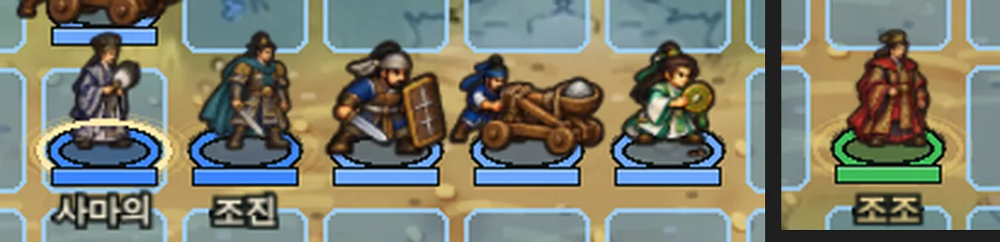
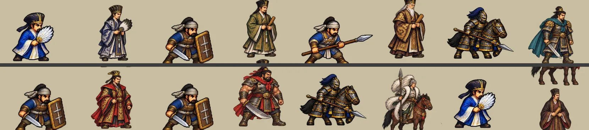

# 장수 전투 모델 재모델링 기준 (Officer Battle Model Remodel Criteria)

전투 화면에서 장수와 병종의 화풍이 맞는지 점검한 결과와, **병종 그림을 기준으로 장수를 다시 그릴 때 따를 기준**을 정리했습니다.

- 점검 시점: 2026-10-08, 커밋 `7878151`(주요 장수 12명 전투 모델 추가) 반영 후
- 수치 측정: 투명하지 않은 화소의 바깥 2px 띠 명도(외곽선), 안쪽 명도·채도, 파랑(200–235°) 비율을 칸마다 잰 값

---

## 0. 결론

**화풍이 맞지 않습니다. 장수는 병종 기준으로 재모델링해야 합니다.**

전투에 나오는 이름 있는 장수는 지금 두 가지로 나뉩니다. 두 쪽 모두 기준을 통과하지 못합니다.

| 구분 | 인원 | 지금 모습 | 문제 |
|---|---|---|---|
| 전용 모델이 있는 장수 | 12명(사마의·소년 사마의·사마랑·사마방·조진·조조·조비·허저·마초·여포·진궁·주유) | 4–5등신 세밀화풍 전신 모델(`officer-battle-*-v2.webp`) | 바로 옆 SD 병사(약 2.5등신)와 등신·선·채색이 다릅니다. 5명은 병종 무기나 탈것도 맞지 않습니다 |
| 전용 모델이 없는 장수 | 나머지 약 80명 | 같은 병종 병사와 **똑같은 그림**. 금빛 고리만 다릅니다 | 그림만으로는 누구인지 알 수 없습니다 |

전투 화면 안에는 화풍 문제가 두 가지 더 있습니다.

| 어디서 | 지금 모습 | 문제 |
|---|---|---|
| 전투 HUD·전투 중 대화창·일기토 얼굴 | 반실사 채색 흉상 | SD 병종 그림과 화풍이 정반대입니다 |
| 일기토·설전 무대 | 몸은 모델·병종 그림, 얼굴은 반실사 | 한 화면에 화풍이 두세 가지 섞입니다 |

### 근거 화면



*S1-06(동관) 출진 직후 실제 화면을 3배로 키웠습니다.*

- 왼쪽부터 사마의, 조진, 병사(보병), 투석기, 병사(풍수사)이고, 오른쪽 끝은 조조(NPC)입니다.
- 장수는 병사보다 머리가 작고 몸이 길며 색이 옅습니다.
- **조진은 중기병인데 말 없이 걸어 다닙니다.**



*같은 병종 병사(왼쪽)와 장수 모델(오른쪽)을 같은 높이로 맞춘 그림입니다.*

- 윗줄: 사마의/책사, 사마랑/보병, 사마방/창병, 조진/중기병
- 아랫줄: 조조/보병, 허저/보병, 마초/중기병, 진궁/책사

### 수치 (외곽선은 시트 전체 중앙값)

| 시트 | 외곽선 명도 | 채도 | 진영색(파랑) 비율 | 판정 |
|---|---|---|---|---|
| 게임에서 쓰는 병종 시트 42장 중 39장 | 0.02–0.04 | 0.55–0.75 | 0.00–0.25 | 통과 |
| `officer-battle-sima-v2` | 0.052 | 0.38 | 0.03 | ✗ |
| `officer-battle-wei-v2` | 0.077 | 0.53 | 0.00 | ✗ |
| `officer-battle-rivals-v2` | 0.098 | 0.52 | 0.00 | ✗ |

- **외곽선 명도**: 값이 클수록 선이 옅거나 가늡니다. 병종 시트는 굵고 거의 검은 선입니다.
- **진영색이 0**인 시트는 적·NPC로 나와도 빨강·초록으로 바뀌지 않습니다. 지금 코드도 장수 모델은 염색하지 않습니다.

---

## 1. 무엇을 기준으로 맞추나

**병종 그림이 기준입니다.**

- 전투 화면은 병종 그림이 대부분을 차지합니다(병종 153개, 4단 진화 시트 완비).
- 장수를 병종 화풍으로 옮겨 그립니다. 병종을 장수 모델이나 반실사 초상 쪽으로 바꾸지 않습니다.
- 반실사 초상(`public/portraits/`)은 **전투 밖 화면**(인물열전, 이야기 장면, 장수록)에서만 계속 씁니다. 자세한 구분은 9장에 있습니다.

---

## 2. 재모델링 대상 판정 기준

전투에 나오는 이름 있는 인물이 아래 중 **하나라도** 해당하면 재모델링 대상입니다.

| 판정 | 기준 | 확인 방법 |
|---|---|---|
| **A. 식별 불가** | 64px 전투 칸에서 같은 병종 병사와 나란히 놓았을 때, 금빛 고리를 가리면 구별이 안 된다 | 10장 1번 |
| **B. 등신 이탈** | 같은 병종 병사보다 머리가 작고 몸이 길다. 기준은 2.3–2.8등신 | 10장 1번(나란히 놓고 머리 높이 비교) |
| **C. 선·채색 이탈** | 시트 외곽선 명도 중앙값이 0.05를 넘는다. 또는 셀 채색 대신 세밀한 선 묘사·부드러운 붓 질감이다 | 5장 |
| **D. 병종 실루엣 이탈** | 병종의 탈것·무기 종류가 없거나 다르다. 예: 중기병인데 말이 없음, 창병인데 창이 없음 | 7장 |
| **E. 진화 단계 누락** | 4단 진화하는 장수(P1)인데 단계별 줄이 없다 | 6장 |
| **F. 진영색 불가** | 진영 옷에 파랑이 없어 적·NPC로 나올 때 염색되지 않는다 | 8장 |

### 대상이 아닌 경우

다음은 병종 그림을 그대로 씁니다.

- 이름 없는 부대 단위: `순찰병`, `서문 수비대`, `오군 전선` 등 병종명·부대명만 있는 유닛
- 플레이어가 만든 **신장수**: 병종 그림을 쓰되, 7장의 공용 장수 표식만 더합니다
- 구조물·호송대: `structureKind`이거나 `convoy_`로 시작하는 유닛
- 환영과 사물: 4장에 따로 정리했습니다

### 이번 점검의 판정

| 장수 | 병종 | A | B | C | D | E | F | 비고 |
|---|---|---|---|---|---|---|---|---|
| 사마의 | 책사 | ✓ | ✗ | ✗ | ✓ | ✗ | △ | 학우선은 맞음. 채도 0.28로 병사보다 훨씬 옅음 |
| 소년 사마의 | 책사 | ✓ | ✗ | ✗ | ✓ | – | △ | 채도 0.33 |
| 사마랑 | 보병 | ✓ | ✗ | ✗ | **✗** | ✗ | ✗ | 관복에 홀. 칼·방패가 없어 보병으로 안 읽힘 |
| 사마방 | 창병 | ✓ | ✗ | ✗ | **✗** | ✗ | ✗ | 노인과 홀. 창이 없음 |
| 조진 | 중기병 | ✓ | ✗ | ✗ | **✗** | ✗ | ✗ | 말이 없음(이동력 큰 기병이 걸어 다님) |
| 조조 | 보병 | ✓ | ✗ | ✗ | △ | – | ✗ | 관복에 칼, 방패 없음 |
| 조비 | 책사 | ✓ | ✗ | ✗ | **✗** | – | ✗ | 책사인데 칼을 휘두름 |
| 허저 | 보병 | ✓ | ✗ | ✗ | △ | – | ✗ | 큰 칼, 방패 없음 |
| 마초 | 중기병 | ✓ | ✗ | ✗ | ✓ | – | ✗ | 말·창 맞음 |
| 여포 | 중기병 | ✓ | ✗ | ✗ | ✓ | – | ✗ | 말·방천극 맞음. 외곽선 0.12로 가장 옅음 |
| 진궁 | 책사 | ✓ | ✗ | ✗ | △ | – | ✗ | 부채 대신 두루마리 |
| 주유 | 궁병(S1-04 환영) | ✓ | ✗ | ✗ | **✗** | – | ✗ | 칼을 듦. 활이 없음 |
| 그 밖의 장수 약 80명 | 각 병종 | **✗** | ✓ | ✓ | ✓ | ✗ | ✓ | 병사와 같은 그림 |

✓ 통과, ✗ 불합격, △ 경계, – 해당 없음(P1이 아니라 진화 줄이 필요 없음)

> **결론**: 이름 있는 전투 장수 **전원**이 재모델링 대상입니다.
> 새로 들어온 12명도 등신(B)과 선·채색(C)에서 전부 걸립니다. 따라서 이 12명도 다시 그려야 합니다.
> 지금 모델은 새 그림이 들어올 때까지 식별용으로 쓰고, 새 그림이 들어오면 교체합니다.

---

## 3. 우선순위

### P1. 플레이어 장수 6명 (4단 진화 전부)

연의 출진에 고정으로 나오고, 4단 진화 모습이 모두 보이는 장수입니다.

| id | 이름 | 기본 병종 | 출진 | 지금 모델 |
|---|---|---|---|---|
| `sima_yi` | 사마의 | strategist 책사 | 30개 장 전부 | 있음(1줄, B·C 불합격) |
| `cao_zhen` | 조진 | heavyCav 중기병 | 10개 장 | 있음(1줄, 말 없음) |
| `sima_lang` | 사마랑 | infantry 보병 | 3개 장 | 있음(1줄, 무기 없음) |
| `sima_fang` | 사마방 | spearman 창병 | 1개 장 | 있음(1줄, 창 없음) |
| `sima_shi` | 사마사 | cavalry 기병 | S2-05·S2-08·S2-13·S3-06 | **없음** |
| `sima_zhao` | 사마소 | crossbow 노병 | S2-05·S2-08·S2-13·S3-05·S3-06 | **없음** |

소년 사마의(`sima_yi_young`)는 사마의 1단의 다른 얼굴로 보고 P1 사마의 시트에 1줄을 더합니다.

### P2. 본편 전투의 이름 있는 적·우군 장수 38명

현재 단계 1줄을 그립니다. 굵게 표시한 이름은 우두머리·목표 장수이거나 여러 장에 나오는 장수라서 먼저 그립니다.
`*`은 지금 전용 모델이 있지만 다시 그려야 하는 장수입니다.

| 병종 | 장수 |
|---|---|
| strategist 책사 | **제갈량**(`wooden_zhuge`, S2-14 수레), **육손**, **조비***, 손권, 장소, 제갈근, 마속, 제갈각, 진궁*(환영) |
| cavalry 기병 | **장합**, **강유**, **조상**, 여몽, 장패, 맹염, 비연 |
| heavyCav 중기병 | **마초***, **조운**, 여포*(환영) |
| infantry 보병 | **조조***, **곽회**(창병 겸용), 허저*, 양앙, 성채 수비대장(장로), 맹달, 왕평, 위연, 조휴, 대릉, 고상, 공손연, 주연, 왕릉 |
| archer 궁병 | **황충**, 주유*(환영) |
| crossbow 노병 | 손소 |
| navy 수군 | 여범 |
| bandit 산적 | 고수 |

여러 장에 나오는 장수는 다음과 같습니다.

- 조조: S1-06·S1-09·S1-10
- 장합: S2-06·S2-11
- 곽회: S2-07·S2-12
- 제갈근: S1-11·S2-04
- 조비: S2-02·S2-03

### P3. 가상 전장(IF·신세력)에만 나오는 장수 47명

현재 단계 1줄을 그립니다. 출처는 `fate.ts`의 루트 대상·우두머리, `EXTRA_TALES`, `scenario-ui.ts`의 `FOE_CLASS`이고, 본편 전투에 없는 이름만 모았습니다.

| 병종 | 장수 |
|---|---|
| cavalry | 관우, 장료, 원상, 조희, 문흠, 하후돈, 조홍, 마대, 문추, 하후패, 하후무, 조창, 원희 |
| heavyCav | 서황, 조인 |
| horseArcher | 답돈, 하후연 |
| infantry | 고간, 황개, 유비, 원담, 정봉, 악진 |
| spearman | 우금, 고람, 학소, 장비 |
| strategist | 심배, 환범, 방통, 순욱, 조식, 조예, 노숙, 봉기, 저수, 하안, 양수 |
| crossbow | 서성 |
| navy | 전종 |
| bandit | 감녕 |
| rattan | 올돌골 |
| assassin | 축융 |
| shaman | 목록대왕, 타사대왕 |
| elephant | 맹획 |
| royalGuard | 조우 |

### 진화 단계를 몇 줄 그리나

- **P1**: 4단을 모두 그립니다(시트 4줄). 플레이어 장수는 레벨에 따라 4단까지 진화하기 때문입니다.
- **P2·P3**: 그 장수가 실제로 나오는 단계 1줄만 그립니다. 같은 장수가 여러 전장에서 다른 단계로 나오면 단계마다 1줄씩 더합니다.
- **나중에 동료가 되는 장수**: 가상 전장에서 설득해 얻는 장수는 동료가 될 때 4줄로 늘립니다.

---

## 4. 예외 인물

| 인물 | 처리 |
|---|---|
| 진궁·여포·주유의 환영(S1-04) | P2와 같은 모델을 쓰고, 코드에서 반투명·청색 안개 효과만 더합니다. 그림을 따로 그리지 않습니다. 주유는 S1-04에서 **궁병**이므로 활을 든 모습으로 그립니다 |
| 제갈량의 수레(`wooden_zhuge`) | 제갈량 모델이 사륜거에 앉은 1줄입니다. 수레는 병종 공성기계 시트와 같은 나무색·외곽선 규칙을 따릅니다 |
| 꿈속의 황제(S1-04) | 대상이 아닙니다. 이야기 연출용 인물입니다 |
| 성채 수비대장(장로, S1-08) | 이름이 장로이므로 P2 대상입니다. 오두미도 도복 요소를 넣습니다 |

---

## 5. 화풍 규격 (병종 시트에서 잰 값)

장수 그림은 아래 기준을 지켜야 합니다. 같은 병종 병사 시트를 옆에 놓고 비교합니다.

### 눈으로 보는 기준 (주 판정)

| 항목 | 병종 시트 | 장수 허용 범위 |
|---|---|---|
| 등신 | SD 약 2.5등신, 큰 머리와 짧은 팔다리 | 2.3–2.8등신. 장수라고 키를 늘리거나 머리를 줄이지 않습니다 |
| 외곽선 | 1–2px의 굵고 거의 검은 선이 몸 전체를 감쌉니다 | 같은 굵기와 색. 갈색·회색 선이나 가는 펜 선은 불합격입니다 |
| 채색 | 셀 채색(밝음·중간·그림자 2–3단), 큰 색 면 | 같은 방식. 옷 무늬를 펜으로 촘촘히 그린 세밀화나 부드러운 붓 질감은 불합격입니다 |
| 크기 | 칸 높이의 0.73–1.0을 채우고, 발이 칸 아래 0.88–1.0에 닿습니다 | 같은 병종 병사보다 최대 +8%(투구 장식 포함) |
| 시점 | 3/4 시점, 오른쪽을 봅니다 | 같은 방향. 왼쪽을 보는 그림은 코드가 뒤집습니다 |
| 배경 | 투명, 바닥 그림자 없음(코드가 그립니다) | 같음 |

### 수치 기준 (보조 판정)

칸마다 투명하지 않은 화소의 바깥 2px 띠 명도(외곽선)와 안쪽 화소의 명도·채도·파랑 비율을 재고, 시트 전체의 중앙값을 봅니다.

**합격·불합격은 시트 전체의 외곽선 명도 중앙값 하나로 가릅니다.**

- 기준: 0.05 이하
- 이 기준으로 재면 게임에서 쓰는 병종 시트 42장 중 39장이 통과합니다. 지금 장수 시트 3장은 모두 떨어집니다.

나머지 수치는 참고로만 봅니다. 병종 시트 800칸의 5–95백분위는 다음과 같습니다.

| 항목 | 범위 | 장수 시트에서 볼 점 |
|---|---|---|
| 몸 명도 | 0.15–0.43 | 장수만 밝게 빛나 보이면 안 됩니다 |
| 채도 | 0.35–0.84(중앙값 0.67) | 시트 중앙값이 0.50보다 낮으면 병사 옆에서 바래 보입니다 |
| 진영색(파랑) 비율 | 0.00–0.25(중앙값 0.09) | 0.03보다 낮으면 적·NPC 염색이 거의 보이지 않습니다(8장) |

---

## 6. 시트 규격

병종 4단 시트(`troops-four-stage-*.webp`)와 같은 구성을 따릅니다.

| 항목 | 값 |
|---|---|
| 한 칸 | 280×224px(병종 시트 1120×896 기준) |
| 가로 | 4칸: 0 대기 · 1 준비(한 걸음) · 2 공격 · 3 피격 |
| 세로 | **진화 단계마다 1줄**(P1은 4줄). 지금 장수 시트처럼 한 장에 장수 여러 명을 줄로 섞지 않습니다 |
| 형식 | webp, 투명 배경, 품질 90 이상 |
| 기준점 | (0.5, 0.88): 발이 칸 아래쪽 12% 지점에 오게 |
| 같은 줄 안 | 네 칸의 발 위치·몸 크기가 같아야 합니다 |
| 칸 넘침 | 무기·말 다리·망토가 이웃 칸을 침범하지 않아야 합니다(지금 `officer-battle-rivals`는 여포의 말이 아래 칸까지 내려옵니다) |
| 파일 이름 | `public/officers/<id>-battle-v1.webp` (예: `sima_yi-battle-v1.webp`) |

**64px에서 읽혀야 합니다.** 실제 전투 칸은 64px입니다. 원본을 64px로 줄였을 때 아래 두 가지가 보여야 합니다.

- 7장의 식별 요소 가운데 2개 이상
- 병종 무기의 종류

---

## 7. 장수만의 표시: 병종 실루엣은 유지, 식별 요소 2–3개

장수를 다시 그려도 **병종이 무엇인지는 한눈에 알아야 합니다.** 전술 게임에서 병종은 상성·이동력·사거리 정보이기 때문입니다.

### 그대로 두는 것 (병종 실루엣)

- 탈것: 기병·중기병·궁기병은 말, 상병은 코끼리. **말이 없는 기병 장수는 불합격입니다.**
- 무기 종류: 보병은 칼과 방패, 창병은 창, 궁병은 활, 노병은 쇠뇌, 책사는 부채.
  - 장수 고유 무기도 같은 종류 안에서 고릅니다.
  - 예: 관우의 청룡언월도는 기병의 장병기라서 괜찮습니다.
  - 예: 책사 조비의 칼은 안 됩니다.
- 몸 자세와 크기
- 단계별 갑옷 변화: 장수도 진화하면 같은 병종 병사와 같은 방향으로 갑옷이 바뀝니다.

### 더하는 것 (장수 식별 요소 2–3개)

한 장수당 아래 목록에서 2–3개를 고릅니다. 같은 병종 장수끼리는 겹치지 않게 합니다.

| 종류 | 예 |
|---|---|
| 투구·관 | 사마의의 높은 관, 조조의 금관, 마초의 사자 투구, 장합의 붉은 술 |
| 고유 무기 | 사마의의 학우선(흰 깃 부채, 병사 것보다 크고 금빛 손잡이), 관우의 청룡언월도, 장비의 사모, 황충의 큰 활, 허저의 큰 칼과 방패 |
| 망토·전포 | 장수만 망토를 두릅니다. 색은 8장 규칙을 따릅니다 |
| 얼굴 | 수염 모양(관우의 긴 수염, 장비의 범 수염), 나이(황충·사마방의 흰 수염), 성별 |
| 말 | 적토마(붉은 말, 여포·관우), 백마(조운), 흑마 |

### 공용 장수 표식

모든 이름 있는 장수와 신장수에게 공통으로 넣습니다.

- 투구나 관 위에 작은 **깃 장식**(병사에게는 없음)
- 갑옷 테두리에 **금색 선** 1줄

### 문관 출신 장수

사마랑·사마방처럼 역사상 문관이지만 게임 병종이 보병·창병인 장수도 **병종 무기를 듭니다.**
문관다움은 관·수염·전포 무늬 같은 식별 요소로 나타냅니다.

---

## 8. 진영 색 호환

전투는 같은 그림을 색만 바꿔 아군 파랑, 적 빨강, NPC 초록으로 씁니다.
코드는 파란 옷 색상대만 바꿉니다(`clothBand`, `DYE_HUE`: 파랑 218 → 빨강 358 / 초록 128).

- **진영 옷은 파랑으로 그립니다.** 색상 200–235° 띠 안에 두고, 병사 시트와 같은 파랑을 씁니다. 전포 안감, 허리띠, 깃발 같은 부분입니다.
- **장수 고유색은 파랑 띠 밖에 둡니다.** 금색·흰색·검정·붉은 술·갈색 가죽처럼 진영과 상관없는 색을 씁니다.
- **파랑 띠 안에 고유 요소를 두지 않습니다.** 예를 들어 파란 관을 쓰면 적일 때 빨간 관이 되어 그 장수다움이 사라집니다.
- 붉은 말(적토마)처럼 원래 빨간 요소는 아군일 때도 빨강으로 남습니다. 의도한 결과라 괜찮습니다.
- 지금 조조(NPC)는 초록 진영인데 빨간 관복이라 적처럼 보입니다. 발밑 원판 색만으로 진영을 구분하고 있습니다.

---

## 9. 전투 화면의 초상(HUD·대화·일기토)

전투 화면 안에서는 초상도 병종 화풍으로 맞춥니다.

| 화면 | 지금 | 바꿀 모습 |
|---|---|---|
| 전투 HUD 장수 얼굴 | 반실사 흉상 | 그 장수의 **SD 흉상**. 전투 모델을 확대한 것이 아니라, 같은 규격으로 따로 그린 흉상입니다 |
| 전투 중 대화창 | 반실사 흉상 | SD 흉상(표정 3종: 보통·분노·웃음) |
| 일기토·설전 얼굴 그림 | 반실사 흉상 | SD 흉상. 무대 위 몸 모델은 6장 시트를 씁니다 |
| 회심(컷인) | 없음·병종 그림 | SD 흉상 확대 |
| 이야기 장면·인물열전·장수록 | 반실사 흉상 | **그대로** 둡니다 |

SD 흉상 규격은 다음과 같습니다.

- 512×512px, 투명 배경
- 5장의 선·채색 규격 적용
- 파일 이름 `public/officers/<id>-face-v1.webp`

---

## 10. 검수 체크리스트

장수 1명을 넣을 때마다 아래를 모두 통과해야 합니다.

1. **나란히 놓기(A·B)**
   - 64px 전투 칸에서 같은 병종·같은 단계 병사 2명과 나란히 놓습니다.
   - 금빛 고리를 끈 상태에서 장수가 바로 구별되어야 합니다.
   - 머리 크기와 등신은 병사와 같아야 합니다.
2. **선·채색(C)**: 시트 외곽선 명도 중앙값이 0.05 이하여야 합니다(5장).
3. **병종 실루엣(D)**: 7장의 탈것·무기 종류가 같은 병종 병사와 같아야 합니다.
4. **진화 줄(E, P1만)**
   - 4줄이 모두 있어야 합니다.
   - 1→4단으로 갈수록 갑옷이 같은 병종 병사와 같은 방향으로 바뀌어야 합니다.
   - 식별 요소는 모든 단계에 남아야 합니다.
5. **진영 색(F)**
   - 파랑·빨강·초록 세 색으로 바꿔 봅니다.
   - 진영 옷만 바뀌고, 고유 요소·피부·금색은 물들지 않아야 합니다.
6. **프레임 정렬**
   - 대기 → 준비 → 공격 → 피격을 이어 재생합니다.
   - 발이 미끄러지거나 몸 크기가 바뀌지 않아야 합니다.
   - 이웃 칸을 침범하지 않아야 합니다.
7. **초상 짝**: SD 흉상과 전투 모델의 식별 요소(관·수염·무기 끝)가 같아야 합니다.
8. **배경 대비**: 초원·흙길·눈·물가 전장 배경 위에서 외곽선이 묻히지 않아야 합니다.

**불합격 사례**(이번 점검에서 실제로 나온 것 포함):

- 병사 옆에 서면 장수만 머리가 작고 키가 큰 그림
- 펜 선 세밀화로 옷 무늬를 그린 그림
- 기병 장수가 말 없이 서 있는 그림(조진)
- 병종과 다른 무기를 든 그림(책사 조비의 칼, 창병 사마방의 홀)
- 진영 옷에 파랑이 없는 그림
- 반실사 얼굴을 SD 몸에 붙인 그림

---

## 11. 코드 연결 계획 (그림이 들어오면)

장수 모델은 이미 `packages/web/src/officer-models.ts`(커밋 `7878151`)로 연결되어 있습니다. 새 그림은 이 구조를 넓혀서 넣습니다.

1. `officerModelSheets`를 장수당 한 장(`<id>-battle-v1.webp`)으로 바꿉니다.
   - 줄은 진화 단계입니다(P1은 4줄, 그 밖에는 1줄).
   - 진화 단계 줄은 병종과 같은 방식(`tierOf`)으로 고릅니다.
2. `battlefield.ts`의 `unitTexture()`에서 장수 모델 텍스처에도 진영 염색(`dyeOfSide` → `needsDye`/`dyedSource`)을 적용합니다. 지금은 장수 모델만 염색을 건너뜁니다.
3. `officerBattleModel()`은 지금처럼 id → 이름 순으로 찾습니다.
   - 우두머리·목표(`boss`/`target`/`of*`)는 `romanceOf(u)?.id`로도 찾게 합니다.
4. `faceFor` → `officerPortrait`는 **전투 화면에서만** `<id>-face-v1.webp`를 먼저 씁니다. 전투 밖 화면은 반실사 초상을 그대로 씁니다.
5. 일기토·설전의 `playContest` `models`는 이미 장수 모델을 쓰므로 그대로 둡니다.
6. 테스트(`test/officer-models.test.ts`)에 아래를 더합니다.
   - 모든 P1 id에 4줄이 있는지
   - 시트 크기가 1120×(224×줄 수)인지
   - 모든 장수 id가 `romanceOf`로 찾히는지

---

## 12. 그림 지시문 틀 (영어)

이미지 생성 모델이나 화가에게 줄 때 쓰는 틀입니다. 실존 게임·화가 이름은 넣지 않습니다.
`{}` 칸을 장수마다 채우고, **같은 병종 병사 시트를 참고 이미지로 함께 줍니다.**
지금 장수 모델(`officer-battle-*-v2.webp`)은 화풍 참고로 주지 않습니다.

```
Sprite sheet, 4 columns x {rows} rows, each cell 280x224 px, transparent background.
Chibi / super-deformed proportions (about 2.5 heads tall, big head, short limbs), thick near-black
outline 1-2 px around the whole figure, flat cel shading with 2-3 tone steps and large color areas,
saturated colors — match the attached {class} soldier sheet exactly in line weight, shading,
proportions, scale and camera angle (3/4 view facing right). No fine pen hatching, no painterly texture.
Columns: idle, ready / one step, attack swing, hit recoil. Rows: evolution tier 1 to {rows},
armor becoming more ornate in the same way as the soldier sheet.
Character: {name}, {one-line description}. Keeps the {class} silhouette: {mount}, {weapon type}.
Unique identifiers on every frame: {identifier 1}, {identifier 2}, {identifier 3}.
Faction cloth (tabard, cape lining, sash) in the same medium blue as the soldier sheet;
all personal colors (gold, white, black, red tassel, brown leather) stay outside the blue hue range.
Small plume on the helmet/hat and a thin gold trim line on the armor edge.
Feet on the same baseline in every cell, nothing crosses into neighboring cells, no ground shadow, no text.
```

예시 — 조진(P1, 중기병 4줄):

- {one-line description}: broad-shouldered Wei general in his thirties with a short beard
- {mount}: armored war horse
- {weapon type}: long cavalry spear
- {identifiers}: teal-green cape (outside blue range) / gold-rimmed helmet with crest / short beard

---

## 부록: 이번 점검에서 함께 확인한 것

- **병종 시트 3장도 선 기준을 벗어납니다.** 장수 재모델링과 별도로 병종 쪽에서 맞출 대상입니다.

  | 시트 | 외곽선 명도 | 비고 |
  |---|---|---|
  | `troops-four-stage-yellow-turban-v2` | 0.242 | 4등신에 가는 선 |
  | `troops-four-stage-dancer-v2` | 0.105 | |
  | `troops-single-stage-navy-v1` | 0.065 | |

- 게임에서 쓰지 않는 옛 병종 시트 7장도 선 기준을 벗어납니다. 화풍 참고로 쓰지 않습니다.
  - dancer-v1, lord-v1, maiden-v1·v2, monk-v2, mounted-strategist-v2, pirate-v2
- 이야기 장면 전신 인물(`officer-story-v1.webp`)은 7등신 채색화입니다. 전투 밖이라 이번 기준의 대상이 아닙니다.
- 이미지 생성은 비용 승인을 받았지만 아직 시작하지 못했습니다. Canva 다운로드 도메인이 막혀 있고, Figma는 planKey가 필요합니다.
