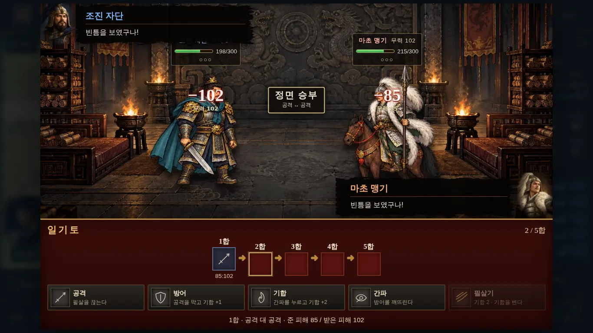
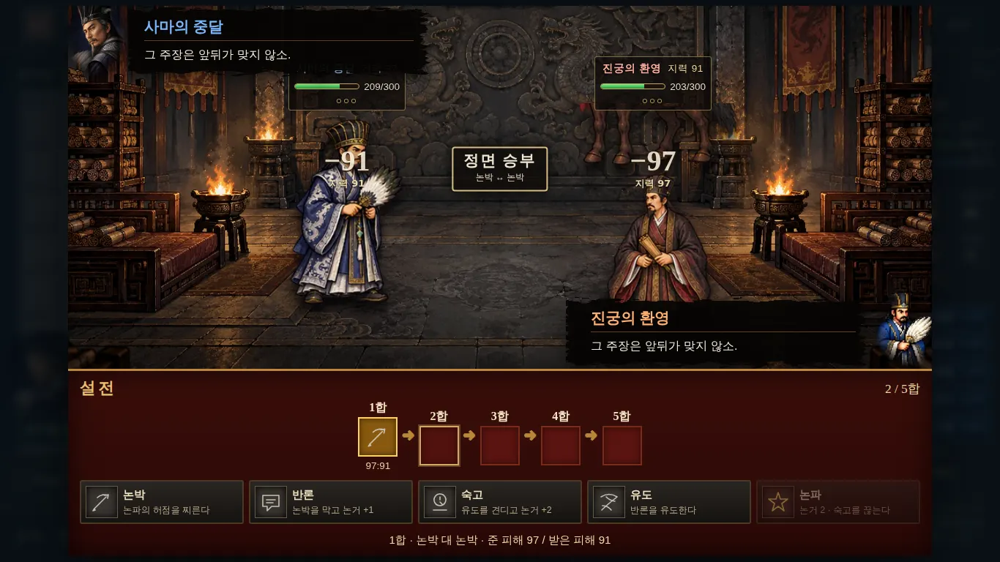
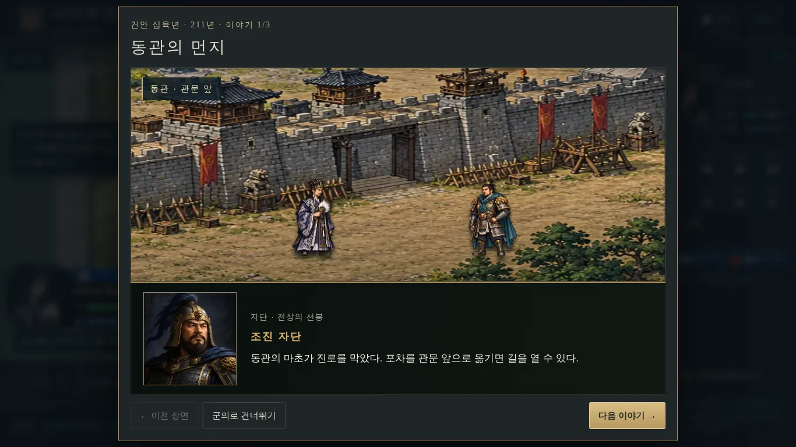

# 장수 그림·연출 기준 (Officer Art & Staging Criteria)

전투 맵, 일기토·설전, 스토리신에서 장수를 어떤 화풍으로 그리고 어떻게 움직일지 정한 기준입니다.

- 점검 시점: 2026-10-08, 커밋 `7878151`(주요 장수 12명 대결 모델 추가) 반영 후
- 이 문서는 작업 요청과 그 결과물을 검수하는 기준으로 함께 씁니다.

**바꾸지 않는 것**
- 능력치, 병종 ID, 이동력, 공격 방식, 책략, 난이도는 그대로 둡니다.
- 바꾸는 것은 그림, 그림 연결, 연출뿐입니다.

---

## 0. 점검 결과 요약

| 화면 | 지금 | 판정 |
|---|---|---|
| 전투 맵 | 장수 12명은 4–5등신 세밀화 모델, 나머지 장수는 병사와 같은 그림에 금빛 고리 | ✗ SD 병사와 등신·선·채색이 다름. 조진은 중기병인데 말이 없음. 장수 그림은 진영색으로 염색되지 않음 |
| 일기토·설전 | 세밀화 대결 모델 + 대결 배경 + 초상 | ○ 화풍은 유지. 크기·모션·겹침·칸 넘침·얼굴 오류는 고쳐야 함 |
| 스토리신 | 3/4 시점 채색 배경 위에 큰 세밀화 전신, 사각 틀 안 반실사 초상 | ✗ 참고 화면(작은 SD 인물, 먹 붓 대사 상자, 일러스트 흉상)과 다름 |

### 근거 화면


*S1-06 출진 직후 화면을 3배로 키운 것입니다. 왼쪽부터 사마의, 조진, 보병, 투석기, 풍수사이고, 오른쪽 끝은 조조(NPC)입니다.*


*같은 병종 병사(왼쪽)와 장수 모델(오른쪽)을 같은 높이로 맞춰 놓았습니다.*
- 윗줄: 사마의/책사, 사마랑/보병, 사마방/창병, 조진/중기병
- 아랫줄: 조조/보병, 허저/보병, 마초/중기병, 진궁/책사



*일기토입니다.*
- 인물이 무대에 비해 작습니다.
- 피해 숫자가 능력치 글씨와 겹칩니다.
- 위쪽 대사 상자가 체력 상자를 가립니다.



*설전입니다.*
- 진궁 머리 위에 여포의 말 다리가 보입니다(시트 칸 넘침).
- 진궁의 대사 얼굴 자리에 일반 책사 그림이 나옵니다.



*스토리신입니다.*
- 인물이 무대 높이의 약 1/3로 큽니다.
- 대화창은 사각 틀 안의 반실사 초상입니다.
- 초상의 조진(금 투구, 수염)과 무대의 조진(투구 없음, 청록 망토)이 서로 다르게 생겼습니다.

---

## 1. 대상 장수

모든 장수를 바꾸지 않습니다. 아래 38명만 작업하고, 나머지 장수는 지금 그림을 그대로 둡니다.

### 대상 A: 주요 장수 14명

전투 SD, 스토리 SD, 스토리 흉상을 모두 만듭니다.

사마의(+ 소년 사마의), 조진, 사마랑, 사마방, 사마사, 사마소, 조조, 조비, 허저, 마초, 여포, 진궁, 주유

- 사마사·사마소는 플레이어 장수인데 지금 전용 그림이 하나도 없습니다.
- 그래서 대결 모델(지금 v2 화풍)도 함께 만듭니다.

### 대상 B: 인기 장수 24명

전투 SD만 만듭니다.

| 진영 | 장수 |
|---|---|
| 촉 | 유비, 관우, 장비, 제갈량, 조운, 황충, 위연, 강유, 방통 |
| 위 | 하후돈, 하후연, 장료, 서황, 장합, 조인, 순욱 |
| 오 | 손권, 육손, 여몽, 감녕, 노숙, 황개 |
| 남만 | 맹획, 축융 |

- 게임 전투(본편이나 가상 전장)에 실제로 나오는 장수 중에서 골랐습니다.
- 병종은 게임 데이터의 값입니다. 본편 장(`packages/data/stages`), `fate.ts`, `EXTRA_TALES`, `FOE_CLASS`에서 가져왔습니다.

---

## 2. 화면별 화풍

| 화면 | 몸(전신) | 얼굴 | 배경 |
|---|---|---|---|
| **전투 맵** | 새 SD 장수 그림(병종 화풍, 장수 강조). 대상 A·B | 지금 초상 유지 | 전장 맵 |
| **일기토·설전** | 지금 세밀화 대결 모델(`officer-battle-*-v2.webp`) 유지 | 지금 초상 유지 | 대결 배경 유지 |
| **스토리신** | 새 SD 장수 그림(이야기 자세). 대상 A | 새 일러스트 흉상. 대상 A | 지금 이야기 배경 유지 |
| 인물열전·장수록 | – | 지금 초상 유지 | – |

**대결용 모델과 전장용 SD 그림은 따로 찾게 나눕니다.**
- 지금 `officer-models.ts`는 같은 그림을 전투 맵과 일기토에 함께 씁니다.
- 앞으로 일기토·설전은 대결 모델을 쓰고, 전투 맵과 스토리 무대는 SD 그림을 씁니다.

**같은 사람은 모든 화면에서 같은 사람으로 보여야 합니다.**
- 새로 그리는 그림(전투 SD, 스토리 SD, 스토리 흉상)은 모두 7장의 장수 식별표를 따릅니다.

---

## 3. 전투 맵: SD 장수 그림 (대상 A·B)

### 3-1. 화풍은 같은 병종 병사와 같게

| 항목 | 기준 |
|---|---|
| 등신 | 같은 병종 병사와 같은 2.3–2.8등신 SD(큰 머리, 짧은 팔다리) |
| 외곽선 | 몸 전체를 감싸는 1–2px의 거의 검은 선 |
| 채색 | 2–3단 셀 채색과 큰 색 면. 펜 선 세밀화나 부드러운 붓 질감은 불합격 |
| 채도 | 병사 수준. 병종 시트 800칸의 중앙값은 0.67, 5–95백분위는 0.35–0.84 |
| 시점 | 3/4 시점, 오른쪽을 봄(왼쪽은 코드가 뒤집음) |
| 배경 | 투명. 바닥 그림자는 그리지 않음(코드가 그림) |

외곽선은 수치로도 확인합니다.
- 투명하지 않은 화소 중 바깥 2px 띠의 명도를 칸마다 재고, 시트 전체의 중앙값을 봅니다.
- 게임에서 쓰는 병종 시트 42장 중 39장이 0.02–0.04입니다.
- 지금 장수 시트는 0.05–0.10입니다(sima 0.052, wei 0.077, rivals 0.098).
- **목표는 0.05 이하입니다.**

### 3-2. 병종 실루엣 유지

- 탈것과 무기 종류는 병종을 따릅니다.

| 병종 | 탈것·무기 |
|---|---|
| 보병 | 칼 + 방패 |
| 창병 | 창 |
| 궁병 | 활 |
| 노병 | 쇠뇌 |
| 기병·중기병 | 말 + 장병기 |
| 궁기병 | 말 + 활 |
| 책사 | 부채 |
| 상병 | 코끼리 |
| 산적·자객 | 같은 병종 병사와 같은 무기 |

- 고유 무기는 같은 종류 안에서 고릅니다.
  - 된다: 기병이 청룡언월도를 드는 것
  - 안 된다: 책사가 칼을 드는 것
- 문관 출신도 병종 무기를 듭니다. 문관다움은 관, 수염, 전포 무늬로 나타냅니다.
- 두 병종으로 나오는 장수 중 무기가 달라지는 경우만 2줄로 그립니다(7장 표의 줄 수).

### 3-3. 장수 강조: 크기는 그대로, 생김새로 구별

- **크기는 같은 병종·같은 단계 병사와 똑같습니다.**
  - 몸 크기, 칸 안에서 차지하는 높이, 발 위치를 병사 시트에 맞춥니다.
  - 투구 장식도 이 높이 안에 넣습니다.
- 7장의 식별 요소 2–3개를 넣습니다.
- 같은 병종 장수끼리는 식별 요소가 겹치지 않게 합니다.
  - 예: 사마의와 제갈량은 둘 다 부채를 든 책사이므로 관과 옷으로 구별합니다.
- 공통 장수 표식을 넣습니다.
  - 투구나 관 위에 작은 깃 장식
  - 갑옷 테두리에 금색 선 1줄
- 64px 칸으로 줄였을 때, 금빛 고리 없이도 장수인지와 무슨 병종인지가 보여야 합니다.

### 3-4. 진영 색

- 진영 옷(전포 안감, 허리띠, 망토 안쪽)은 병사와 같은 파랑(색상 200–235°)으로 칠합니다.
- 장수 고유색은 파랑 범위 밖에 둡니다.
- NPC 진영색(초록)과 헷갈릴 수 있는 고유색은 짙게 칠합니다.
  - 예: 관우의 녹색은 짙은 녹색으로 칠합니다.
  - 이때도 진영 옷 부분은 반드시 파랑으로 둡니다.
- `battlefield.ts`의 `unitTexture()`에서 장수 그림에도 병사와 같은 염색(`dyeOfSide` → `needsDye`/`dyedSource`)을 적용합니다.
  - 지금은 장수 그림만 염색을 건너뛰어, NPC 조조가 빨간 옷으로 나옵니다.

### 3-5. 시트 규격

| 항목 | 값 |
|---|---|
| 파일 | `public/officers/<id>-battle-v1.webp`. 병종이 둘인 장수는 `<id>-battle-<병종>-v1.webp`, 제갈량 수레는 `zhuge_liang-battle-cart-v1.webp` |
| 한 칸 | 같은 병종 병사 시트와 같은 크기. 280×224(책사·보병·창병·기병·궁기병·상병) 또는 350×280(중기병·노병·궁병·산적·자객) |
| 가로 | 4칸: 대기·준비·공격·피격 |
| 세로 | 7장 표의 줄 수. 플레이어 장수 6명(사마의·조진·사마랑·사마방·사마사·사마소)은 진화 4단계 4줄 |
| 진화 | 단계가 오를수록 갑옷이 같은 병종 병사와 같은 방향으로 바뀜. 줄은 `tierOf`로 고름 |
| 칸 넘침 | 무기·말·망토가 이웃 칸을 넘지 않음 |
| 형식 | webp, 투명 배경, 품질 90 이상 |
| 기준점 | (0.5, 0.88). 발이 칸 아래쪽 12% 지점 |

장수를 찾는 방법은 다음과 같습니다.
- id로 먼저 찾고, 없으면 이름으로 찾습니다.
- 우두머리·목표(`boss`/`target`/`of*`) id는 `romanceOf(u)?.id`로도 찾습니다. 인기 장수는 가상 전장에서 이 id로 나옵니다.
- "○○의 환영"은 "○○"로 찾습니다.

---

## 4. 일기토·설전: 화풍 유지, 크기·모션·타격감 보강

### 4-1. 크기와 배치

| 항목 | 기준 |
|---|---|
| 발 기준선 | 두 사람이 같은 높이. 무대 아래에서 약 15% |
| 키 | 걸어서 싸우는 장수는 무대 높이의 약 55–60%, 말 탄 장수는 말 포함 약 65–70% |
| 간격 | 무대 너비의 약 35%. 서로 마주 봄 |
| 피해 숫자 | 맞은 사람 머리 위에 띄우고, 위로 떠오르며 사라짐. 이름·능력치 글씨와 겹치지 않음 |
| 대사 상자 | 체력 상자와 겹치지 않음 |

### 4-2. 일기토 모션

- 대결 모델 시트의 4칸(대기·한 걸음·공격·방어/피격)을 모두 씁니다. 지금은 `officerModelStyle`이 `frame=0` 한 장만 보여 줍니다.
- 소리는 지금의 `contestSound`를 씁니다.

| 행동 | 동작 |
|---|---|
| 공격 | ① 한 걸음 칸으로 상대 쪽 약 40%까지 돌진(0.2초)<br>② 공격 칸에서 0.08초 멈춤(히트스톱)<br>③ 상대는 피격 칸으로 바뀌고 20–30px 뒤로 밀림. 흰 번쩍임과 베기 궤적<br>④ 원위치로 복귀(0.3초) |
| 방어 | 방어 칸 유지. 막는 순간 불꽃이 튀고 10px 밀림 |
| 기합 | 제자리에서 기를 모으는 빛 오라. 기합 칸(○○○)이 하나씩 차는 게 보임 |
| 간파 | 옆으로 반 걸음 비켜서고, 상대 공격이 빗나감 |
| 필살기 | ① 초상을 띠 모양으로 크게 보여 주는 컷인(0.5초)<br>② 돌진해서 2연타<br>③ 화면을 강하게 흔들고 큰 베기 이펙트<br>④ 상대가 크게 날아갔다가 일어남 |
| 정면 승부 | 두 사람이 가운데로 동시에 돌진해 부딪치고, 불꽃과 함께 서로 튕겨 나감 |
| 승패 | 진 쪽은 무릎 꿇는 자세(피격 칸을 아래로 기울임), 이긴 쪽은 무기를 드는 자세(공격 칸) |

말 탄 장수는 돌진할 때 말이 위아래로 뛰는 흔들림을 넣습니다.

### 4-3. 설전 모션

무기를 휘두르지 않습니다. 공격 칸은 "지휘"(부채나 손으로 가리키기)로 씁니다.

| 행동 | 동작 |
|---|---|
| 논박 | 한 걸음 나서며 가리키기. 말의 충격파가 상대에게 날아가고 상대가 휘청함 |
| 반론 | 손을 들어 막기. 충격파가 부서짐 |
| 숙고 | 제자리 정지. 머리 위에 생각 이펙트 |
| 유도 | 옆으로 비켜서고, 상대 논박이 헛나감 |
| 논파 | 컷인 후 큰 충격파. 상대가 크게 물러나 무릎 꿇음 |

### 4-4. 고칠 오류

- **칸 넘침**
  - `officer-battle-rivals-v2.webp`에서 여포의 말 다리가 아래 칸으로 내려옵니다.
  - 시트를 정리하고, CSS 경로(`officerModelStyle`)도 칸 밖을 잘라 냅니다.
- **환영 얼굴**
  - "진궁의 환영"의 대사 얼굴이 일반 책사 그림으로 나옵니다.
  - `duel-ui.ts`의 `face()` → `bustFace`에서 "○○의 환영"을 "○○"로 바꿔 찾습니다.
  - 여포·주유의 환영도 같이 확인합니다.

---

## 5. 스토리신: 참고 화면 화풍 (대상 A)

참고 화면은 조조전식 이야기 장면입니다. 구성은 다음과 같습니다.
- 위에서 비스듬히 본 3/4 시점의 채색 실내·야외 배경
- 그 위에 작은 SD 인물
- 검은 먹 붓 띠 모양의 대사 상자
- 상자 옆에 걸친, 선이 또렷한 2D 일러스트 흉상

### 5-1. 무대 인물

- 3장의 SD 장수 그림과 같은 인물을 무대에도 씁니다.
- 지금 무대에 서 있는 그림은 둘 다 쓰지 않습니다.
  - 4–5등신 세밀화 전신(`officer-story-v1.webp`)
  - 공용 문관·무장 그림의 색만 바꾼 그림
- 이야기용 자세 시트를 따로 만듭니다.

| 항목 | 값 |
|---|---|
| 파일 | `public/officers/<id>-story-v1.webp` |
| 가로 | 8칸: 서기·걷기 A·걷기 B·말하기·절·무릎 꿇기·놀람·가리키기 (`story-pixel.ts`의 `PX_POSE`) |
| 세로 | 3줄: 앞·뒤·옆 |
| 탈것 | 말에서 내린 모습 |
| 생김새 | 얼굴·옷·식별 요소가 전투 SD와 같음 |

- 무대 인물은 무대 높이의 약 1/8–1/6 크기로 둡니다(지금은 약 1/3).
- 이 크기는 같은 무대의 이름 없는 병사·백성과 같은 기준입니다.
- `story-figure.ts`는 대상 A에 이 시트를 먼저 씁니다.

### 5-2. 대화창

| 항목 | 기준 |
|---|---|
| 대사 상자 | 검은 먹 붓 띠 |
| 이름 줄 | 금색 글씨로 "이름 자"(예: 조조 맹덕) |
| 흉상 | 상자 바깥 왼쪽이나 오른쪽, 말하는 사람 쪽에 틀 없이 크게 걸쳐 놓음 |
| 해설 | 반투명 검은 띠 가운데에 글 |

### 5-3. 스토리 흉상

| 항목 | 값 |
|---|---|
| 파일 | `public/officers/<id>-bust-v1.webp` |
| 화풍 | 선이 또렷한 2D 일러스트 채색. 사진에 가까운 반실사는 쓰지 않음 |
| 크기 | 1024px, 투명 배경 |
| 표정 | 3종: 보통·분노·웃음 |

대상 A가 아닌 장수는 지금 초상(`public/portraits`)을 그대로 씁니다.

### 5-4. 배경

지금 이야기 배경(`story-backgrounds-1/2/3.webp` 등)은 그대로 둡니다.

---

## 6. 예외 인물

| 인물 | 처리 |
|---|---|
| 진궁·여포·주유의 환영(S1-04) | 본인 그림을 쓰고, 코드에서 반투명·청색 안개만 더함. 주유는 S1-04에서 궁병이므로 궁병 줄을 씀 |
| 제갈량의 수레(`wooden_zhuge`, S2-14) | 제갈량 전투 SD 시트에 사륜거에 앉은 1줄을 더함. 수레는 공성기계 시트와 같은 나무색·외곽선 |
| 꿈속의 황제(S1-04) | 대상 아님 |
| 플레이어가 만든 신장수 | 대상 아님. 병종 그림과 직접 만든 초상을 그대로 씀 |

---

## 7. 장수 식별표

이 표가 출발점입니다. 작업자는 초상(`public/portraits`)을 보고 관·투구, 수염, 대표 무기, 대표색 2–3가지를 확정해 이 표를 고칩니다. 새로 그리는 그림은 모두 이 표를 따릅니다.

### 대상 A: 주요 장수 14명

| 장수 | id | 병종 | 탈것·무기 | 식별 요소 | 줄 수 |
|---|---|---|---|---|---|
| 사마의 | `sima_yi` | 책사 | 부채 | 높은 검은 관, 큰 학우선(금빛 손잡이), 검은 전포 | 4 |
| 소년 사마의 | `sima_yi_young` | 책사 | 부채 | 관 없이 묶은 머리, 작은 깃 부채, 흰 서생 옷 | 사마의 시트에 +1 |
| 조진 | `cao_zhen` | 중기병 | 말 + 창 | 금 투구와 깃, 짧은 수염, 청록 망토 | 4 |
| 사마랑 | `sima_lang` | 보병 | 칼 + 방패 | 문관 관, 단정한 수염, 녹갈색 전포 | 4 |
| 사마방 | `sima_fang` | 창병 | 창 | 흰 수염, 노인 관, 갈색 전포 | 4 |
| 사마사 | `sima_shi` | 기병 | 말 + 창 | 검은 투구, 날카로운 눈매, 검은 망토 | 4 |
| 사마소 | `sima_zhao` | 노병 | 쇠뇌 | 금테 투구, 짧은 수염, 자주색 망토 | 4 |
| 조조 | `cao_cao` | 보병 | 칼 + 방패 | 금관, 붉은 망토, 짧은 수염 | 1 |
| 조비 | `cao_pi` | 책사 | 부채 | 작은 금관, 자주색 도포, 젊은 얼굴 | 1 |
| 허저 | `xu_chu` | 보병 | 큰 칼 + 방패 | 거구에 드러낸 팔, 붉은 두건, 붉은 허리띠 | 1 |
| 마초 | `ma_chao` | 중기병·기병 | 말 + 창 | 사자 투구, 흰 털 망토 | 1 |
| 여포 | `lu_bu` | 중기병·기병 | 말 + 방천화극 | 수염 없는 각진 얼굴, 은흑색 귀면 흉갑, 좌우로 길게 휘는 붉은 꿩깃 두 개, 적토마 | 1 |
| 진궁 | `chen_gong` | 책사 | 부채 | 검은 관, 짙은 갈색 도포, 짧은 수염 | 1 |
| 주유 | `zhou_yu` | 궁병·책사 | 궁병 줄은 활, 책사 줄은 부채 | 젊은 미남, 금관, 붉은 망토 | 2 |

### 대상 B: 인기 장수 24명

| 장수 | 병종 | 탈것·무기 | 식별 요소 | 줄 수 |
|---|---|---|---|---|
| 유비 | 보병 | 칼 + 방패 | 큰 귀와 온화한 얼굴, 황색 관, 허리에 쌍고검 한 자루 더 | 1 |
| 관우 | 기병 | 말 + 청룡언월도 | 긴 검은 수염, 붉은 얼굴, 금관, 짙은 녹색 갑옷·전포 | 1 |
| 장비 | 창병 | 장팔사모(뱀 모양 창끝) | 범 수염, 검은 얼굴, 부릅뜬 눈 | 1 |
| 제갈량 | 책사 | 백우선 | 윤건(두건), 흰 학창의 | 1 (+수레 1) |
| 조운 | 중기병·기병 | 백마 + 창 | 은빛 갑옷, 흰 술, 흰 망토 | 1 |
| 황충 | 궁병 | 큰 활 | 흰 수염 노장, 금빛 갑옷 | 1 |
| 위연 | 보병 | 큰 칼 + 방패 | 검은 투구에 붉은 술, 사나운 얼굴 | 1 |
| 강유 | 기병 | 말 + 창 | 젊은 장수, 은 투구에 흰 술, 갈색 말 | 1 |
| 방통 | 책사 | 부채 | 투박한 얼굴, 덥수룩한 수염, 갈색 도사풍 도포 | 1 |
| 하후돈 | 기병 | 말 + 창 | 한쪽 눈 안대, 검은 갑옷 | 1 |
| 하후연 | 궁기병 | 말 + 활 | 날렵한 체격, 붉은 망토, 가벼운 갑옷 | 1 |
| 장료 | 기병 | 흑마 + 극 | 검은 갑옷, 위엄 있는 수염 | 1 |
| 서황 | 중기병 | 말 + 큰 도끼 | 넓은 도끼날, 두꺼운 중갑, 갈색 말 | 1 |
| 장합 | 기병 | 말 + 창 | 붉은 술, 은갑 | 1 |
| 조인 | 중기병 | 말 + 창 | 두꺼운 중갑, 등에 멘 방패, 굵은 수염 | 1 |
| 순욱 | 책사 | 부채 | 단정한 관, 긴 수염, 학자풍 회색 도포 | 1 |
| 손권 | 책사 | 부채 | 붉은 수염, 금관, 군주 망토 | 1 |
| 육손 | 책사 | 부채 | 젊은 서생, 흰 도포, 붉은 끈 관 | 1 |
| 여몽 | 기병·보병 | 기병 줄은 말 + 창, 보병 줄은 칼 + 방패 | 중갑, 붉은 전포, 짧은 수염 | 2 |
| 감녕 | 산적 | 산적 병사와 같은 무기 | 허리의 금방울, 깃털 머리장식, 문신 | 1 |
| 노숙 | 책사 | 부채 | 온화한 얼굴, 갈색 관복, 둥근 관 | 1 |
| 황개 | 보병 | 쇠채찍 + 방패 | 흰 수염 노장, 금빛 갑옷과 붉은 어깨·허리 장식 | 1 |
| 맹획 | 상병 | 코끼리 | 짐승 가죽 옷, 깃털 머리장식, 거구 | 1 |
| 축융 | 자객 | 비도(던지는 칼) | 여전사, 붉은 머리장식, 표범 가죽 | 1 |

---

## 8. 작업 순서

| 순서 | 작업 |
|---|---|
| 1 | 장수 식별표 확정(7장, 38명) |
| 2 | 대상 A 14명 전투 SD + 진영 염색 적용 |
| 3 | 일기토·설전 크기·모션·오류(4장) |
| 4 | 스토리신: 대상 A 스토리 SD·흉상, 대화창(5장) |
| 5 | 사마사·사마소 대결 모델 |
| 6 | 대상 B 24명 전투 SD. 촉 → 위 → 오 → 남만 순 |

---

## 9. 검수

### 9-1. 테스트 (`test/officer-models.test.ts`)

- 대상 A 14명에게 전투 SD, 스토리 SD, 스토리 흉상, 대결 모델이 있는가
- 대상 B 24명에게 전투 SD가 있는가
- 플레이어 장수 6명의 전투 SD가 4줄인가
- 시트 크기가 (병종 병사 시트의 칸 크기) × 4칸 × 줄 수인가
- 전투 SD의 몸 높이가 같은 병종 병사 시트와 같은가
- "○○의 환영"과 우두머리·목표 id가 원래 장수의 그림·얼굴로 찾아지는가

### 9-2. 화면 확인

작업 전후로 같은 장면을 1366×768에서 캡처해 비교합니다. 0장의 그림이 작업 전 화면입니다.

| 화면 | 장면 | 확인할 것 |
|---|---|---|
| 전투 | S1-06 출진 직후 | 장수와 병사의 등신·선·크기가 같은지, 금빛 고리 없이 장수가 구별되는지, NPC 조조가 초록 진영색인지. 64px 칸에서도 확인 |
| 전투(인기 장수) | S1-10 조운, S2-14 제갈량, 가상 전장 관우·장비 각 1장 | 위와 같은 기준 |
| 일기토 | S1-06 조진 대 마초 | 크기와 발 기준선, 돌진·타격·넉백·필살기 컷인, 숫자·대사 상자 겹침 |
| 설전 | S1-04 사마의 대 진궁의 환영 | 말 다리 넘침과 진궁 대사 얼굴이 고쳐졌는지, 무기 휘두르기가 없는지 |
| 스토리 | S1-06 「동관의 먼지」 | SD 인물 크기, 먹 붓 대사 상자, 흉상 위치, 무대 인물과 흉상이 같은 사람으로 보이는지 |

### 9-3. 불합격 사례

- 병사 옆에 서면 장수만 머리가 작고 키가 큰 그림
- 장수만 병사보다 크게 그린 그림
- 펜 선 세밀화로 옷 무늬를 그린 전투 SD
- 기병 장수가 말 없이 서 있는 그림
- 병종과 다른 종류의 무기를 든 그림
- 진영 옷에 파랑이 없는 그림
- 같은 장수가 전투 SD, 스토리 SD, 흉상에서 서로 다르게 생긴 그림
- 이웃 칸을 침범하는 그림

---

## 10. 그림 지시문 틀 (영어)

이미지 생성 모델이나 화가에게 주는 틀입니다.
- 실존 게임·작품·화가 이름은 넣지 않습니다.
- `{}` 칸은 7장 식별표로 채웁니다.

### 10-1. 전투 SD

참고 그림으로 같은 병종 병사 시트를 함께 줍니다.

```
Sprite sheet, 4 columns x {rows} rows, each cell 280x224 px, transparent background.
Chibi / super-deformed proportions (about 2.5 heads tall, big head, short limbs), thick near-black
outline 1-2 px around the whole figure, flat cel shading with 2-3 tone steps and large color areas,
saturated colors — match the attached {class} soldier sheet exactly in line weight, shading,
proportions, body size, foot position and camera angle (3/4 view facing right).
The officer must be exactly the same height and size as the soldier; helmet ornaments stay inside that height.
No fine pen hatching, no painterly texture.
Columns: idle, ready, attack, hit recoil. Rows: evolution tier 1 to {rows},
armor becoming more ornate in the same way as the soldier sheet.
Character: {name}, {one-line description}. Keeps the {class} silhouette: {mount}, {weapon}.
Unique identifiers on every frame: {identifier 1}, {identifier 2}, {identifier 3}.
Small plume on the helmet/hat and a thin gold trim line on the armor edge.
Faction cloth (tabard, cape lining, sash) in the same medium blue as the soldier sheet;
all personal colors stay outside the blue hue range.
Feet on the same baseline in every cell, nothing crosses into neighboring cells, no ground shadow, no text.
```

### 10-2. 스토리 SD

참고 그림으로 그 장수의 전투 SD 시트를 함께 줍니다.

```
Sprite sheet, 8 columns x 3 rows, transparent background, the same character, line weight,
proportions and colors as the attached battle sprite sheet, dismounted.
Rows: facing front, facing back, facing side (right).
Columns: stand, walk A, walk B, talking gesture, bow, kneel, surprised, pointing.
Same baseline in every cell, nothing crosses into neighboring cells, no shadow, no text.
```

### 10-3. 스토리 흉상

참고 그림으로 참고 화면의 흉상 화풍과 그 장수의 초상을 함께 줍니다.

```
Bust portrait, 1024 x 1024 px, transparent background, head and shoulders turned slightly toward the viewer.
2D illustrated painting with clear ink linework and rich flat-to-soft color, classic historical strategy
game character art — not photorealistic. Same face, headwear, beard and colors as the attached portrait:
{name}, {identifier 1}, {identifier 2}, {identifier 3}.
Three versions with the same pose and framing: neutral, angry, smiling. No text, no frame.
```

---

## 부록

- 병종 시트 3장도 외곽선 기준(0.05)을 벗어납니다. 장수 작업과 별개로 맞출 대상입니다.

  | 시트 | 외곽선 명도 |
  |---|---|
  | `troops-four-stage-yellow-turban-v2` | 0.242 |
  | `troops-four-stage-dancer-v2` | 0.105 |
  | `troops-single-stage-navy-v1` | 0.065 |

- 인기 장수의 식별 요소(7장)는 연의에서 흔히 쓰는 이미지로 적었습니다. 게임 초상과는 아직 하나하나 맞춰 보지 않았습니다.
